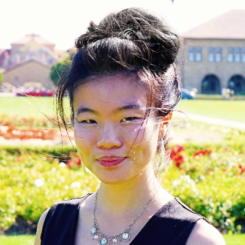
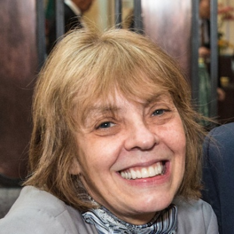

# About Climate Change AI

Climate Change AI is a group of volunteers from academia and industry who believe in using machine learning, where it is relevant, to help tackle the climate crisis.  We aim to facilitate meaningful action by a range of stakeholders &mdash; researchers and engineers, entrepreneurs and investors, established businesses, the public sector, and more.

We believe that:
* **There are many ways to have an impact:** The diversity of problems posed by climate change can be seen as an opportunity; there are many ways to have an impact.
* **AI is a powerful tool:** AI and ML can enable or accelerate many strategies to address climate change. That said, it is not a silver bullet.
* **Collaboration is key:** Effective solutions require cooperation between AI/ML experts and other stakeholders working in areas relevant to climate change.

## Our Vision
A world where effective climate change mitigation and robust adaptation strategies are deployed for the benefit of all.

## Our Mission
To empower work that meaningfully addresses the climate crisis and is well-served by machine learning tools.

## Our Goals

* To facilitate work at the intersection of climate change and machine learning through resource- and knowledge-sharing.
* To enable impactful collaborations by connecting machine learning experts and experts working in areas relevant to climate change through physical and digital platforms.
* To promote discourse about best practices regarding the use of machine learning in climate change domains.

# People

## Core Team

<a class="person__item" href="http://www.davidrolnick.com" target="_blank">
  

    
  

  
David Rolnick

  
University of Pennsylvania

</a>

<a class="person__item" href="https://priyadonti.com/" target="_blank">
  

    
  

  
Priya L. Donti

  
Carnegie Mellon

</a>

<a class="person__item" href="https://epg.ethz.ch/people/senior-researchers/dr--lynn-kaack.html" target="_blank">
  

    
  

  
Lynn H. Kaack

  
ETH Zürich

</a>

<a class="person__item" href="https://mila.quebec/en/person/kris-sankaran/" target="_blank">
  

    
  

  
Kris Sankaran

  
Mila, U. de Montréal

</a>

<a class="person__item" href="https://www.sashaluccioni.com/" target="_blank">
  

    
  

  
Sasha Luccioni

  
Mila, U. de Montréal

</a>

<a class="person__item" href="https://asross.github.io/" target="_blank">
  

    
  

  
Andrew Slavin Ross

  
Harvard University

</a>

<a class="person__item" href="http://www.kochanski.org/kelly/" target="_blank">
  

    
  

  
Kelly Kochanski

  
CU Boulder

</a>

<a class="person__item" href="https://scholar.google.com/citations?user=71a2-WMAAAAJ&hl=en" target="_blank">
  

    
  

  
Alexandre Lacoste

  
Element AI

</a>

<a class="person__item" href="https://www.mcc-berlin.net/en/about/team/milojevic-dupont-nikola.html" target="_blank">
  

    
  

  
Nikola Milojevic-Dupont

  
MCC Berlin, TU Berlin

</a>

<a class="person__item" href="https://konstantinklemmer.github.io" target="_blank">
  

    
  

  
Konstantin Klemmer

  
University of Warwick

</a>

<a class="person__item" href="http://www.teganmaharaj.com" target="_blank">
  

    
  

  
Tegan Maharaj

  
Mila, Polytechnique Montréal

</a>

<a class="person__item" href="https://www.evansherwin.com/" target="_blank">
  

    
  

  
Evan D. Sherwin

  
Stanford University

</a>

<a class="person__item" href="http://sharonzhou.me/" target="_blank">
  

    
  

  
Sharon Zhou

  
Stanford University

</a>

<a class="person__item" href="https://daviddao.org/" target="_blank">
  

    
  

  
David Dao

  
ETH Zurich

</a>

## Advisors

<a class="person__item" href="https://mila.quebec/en/yoshua-bengio/" target="_blank">
  

    
  

  
Yoshua Bengio

  
Mila, U. de Montréal

</a>

<a class="person__item" href="https://data.berkeley.edu/jennifer-chayes" target="_blank">
  

    
  

  
Jennifer Chayes

  
UC Berkeley

</a>

<a class="person__item" href="https://www.mcc-berlin.net/en/about/team/creutzig-felix.html" target="_blank">
  

    
  

  
Felix Creutzig

  
MCC Berlin, TU Berlin

</a>

<a class="person__item" href="https://ai.google/research/people/JohnPlatt" target="_blank">
  

    
  

  
John C. Platt

  
Google AI

</a>

<a class="person__item" href="https://deepmind.com/" target="_blank">
  

    
  

  
Demis Hassabis

  
DeepMind

</a>

<a class="person__item" href="https://www.andrewng.org/" target="_blank">
  

    
  

  
Andrew Y. Ng

  
Stanford University

</a>

<a class="person__item" href="https://www.cs.cornell.edu/gomes/" target="_blank">
  

    
  

  
Carla Gomes

  
Cornell University

</a>

<a class="person__item" href="http://koerding.com/" target="_blank">
  

    
  

  
Konrad P. Körding

  
University of Pennsylvania

</a>

<a class="person__item" href="http://zicokolter.com/" target="_blank">
  

    
  

  
Zico Kolter

  
Carnegie Mellon

</a>

<a class="person__item" href="https://ines.stanford.edu" target="_blank">
  

    
  

  
Inês Azevedo

  
Stanford University

</a>

<a class="person__item" href="https://epg.ethz.ch/people/group-head/prof--dr--tobias-schmidt.html" target="_blank">
  

    
  

  
Tobias Schmidt

  
ETH Zürich

</a>

<a class="person__item" href="https://www.eye-on.ai" target="_blank">
  

    
  

  
Craig Smith

  
Eye on AI

</a>

# Organizational Structure

## CCAI Chairs
- David Rolnick
- Priya L. Donti
- Lynn H. Kaack

## Content Committee
- Sasha Luccioni (<em>Committee Chair</em>)
- Alexandre Lacoste (<em>Datasets Lead</em>)
- Evan D. Sherwin (<em>Meetups Lead</em>)
- Kris Sankaran

## Communications Committee
- Kris Sankaran (<em>Newsletter Lead, Forum Lead</em>)
- Andrew Ross (<em>Web Lead</em>)
- Konstantin Klemmer (<em>Social Media Lead</em>)

## Community Leads
- David Rolnick (<em>Tech Industry and ML Academia</em>)
- Priya L. Donti (<em>Power Sector</em>)
- Lynn H. Kaack (<em>Public Sector and International Organizations</em>)
- Kelly Kochanski (<em>Climate and Earth Sciences</em>)
- Nikola Milojevic-Dupont (<em>Buildings and Transportation</em>)
- David Dao (<em>Agriculture, Forestry, and Other Land Use</em>)
- Sharon Zhao (<em>Entrepreneurship</em>)

# Press

## Releases
* Nov. 11, 2019: <a href="/press_releases/2019-11-11/release.html" target="_blank">press release</a> and [press packet](/press_releases/2019-11-11/press_packet.zip)

## Selected coverage
* "Not Cool: A Climate Podcast" by the Future of Life Institute: <a href="https://futureoflife.org/2019/10/22/not-cool-ep-16-tackling-climate-change-with-machine-learning-part-1/" target="_blank">Part 1</a> and <a href="https://futureoflife.org/2019/10/24/not-cool-ep-17-tackling-machine-learning-with-climate-change-part-2/" target="_blank">Part 2</a>
* Eye on A.I. podcast: <a href="https://www.eye-on.ai/podcast-024" target="_blank">"Climate Change and AI"</a>
* National Geographic: <a href="https://www.nationalgeographic.com/environment/2019/07/artificial-intelligence-climate-change/" target="_blank">"How artificial intelligence can tackle climate change"</a>
* The Verge: <a href="https://www.theverge.com/2019/6/25/18744034/ai-artificial-intelligence-ml-climate-change-fight-tackle" target="_blank">"Here’s how AI can help fight climate change according to the field’s top thinkers"</a>
* MIT Technology Review: <a href="https://www.technologyreview.com/s/613838/ai-climate-change-machine-learning/" target="_blank">"Here are 10 ways AI could help fight climate change"</a>

