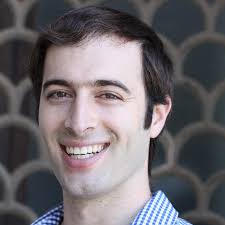

## Steering Committee

| 	      				       |
| --------------------------:|
| 
 <a href="http://www.davidrolnick.com/">   David Rolnick (University of Pennsylvania) |
| 
 <a href="https://priyadonti.com/">   Priya L. Donti (Carnegie Mellon University) |
| 
 <a href="https://priyadonti.com/">   Lynn H. Kaack (ETH Zurich) |
| 
 <a href="http://www.kochanski.org/kelly/">   Kelly Kochanski (University of Colorado at Boulder) |
| 
 <a href="https://scholar.google.com/citations?user=71a2-WMAAAAJ&hl=en">   Alexandre Lacoste ( Element AI) |
| 
 <a href="https://mila.quebec/en/person/kris-sankaran/">   Kris Sankaran (Mila, Université de Montréal) |
| 
 <a href="https://asross.github.io/">   Andrew Slavin Ross (Harvard University) |
| 
 <a href="https://www.mcc-berlin.net/en/about/team/milojevic-dupont-nikola.html)">   Nikola Milojevic-Dupont (Mercator Research Institute on Global Commons and Climate Change) |
| 
 <a href="https://www.media.mit.edu/people/jaquesn/overview/)">   Natasha Jaques (MIT) |
| 
 <a href="https://www.annawab.com/">   Anna Waldman-Brown (MIT) |
| 
 <a href="https://www.sashaluccioni.com/">   Sasha Luccioni (Mila, Université de Montréal) |
| 
 <a href="http://www.teganmaharaj.com">   Tegan Maharaj (Mila, Université de Montréal) |
| 
 <a href="https://www.evansherwin.com/">   Evan D. Sherwin (Carnegie Mellon University) |

## Steering Committee

| 	      				       |
| --------------------------:|
| 
 <a href="https://mila.quebec/en/yoshua-bengio/">   Yoshua Bengio (Mila, Université de Montréal) |
| 
 <a href="https://www.microsoft.com/en-us/research/people/jchayes/">   Jennifer Chayes (Microsoft Research) |
| 
 <a href="https://www.mcc-berlin.net/en/about/team/creutzig-felix.html">   Felix Creutzig (Mercator Research Institute on Global Commons and Climate Change, Technische Universitat Berlin) |
| 
 <a href="https://www.cs.cornell.edu/gomes/">   Carla Gomes (Cornell University) |
| 
 <a href="https://en.wikipedia.org/wiki/Demis_Hassabis">   Demis Hassabis (DeepMind) |
| 
 <a href="http://koerding.com/">   Konrad P. Kording (University of Pennsylvania) |
| 
 <a href="https://www.andrewng.org/">   Andrew Y. Ng (Stanford University) |
| 
 <a href="https://ai.google/research/people/JohnPlatt">   John C. Platt  (Google AI) |

## Webmasters
* Tegan Maharaj (Mila, Université de Montréal)
* Narmada Balasooriya (ConscientAI)
* Andrew Slavin Ross (Harvard University)
* Sasha Luccioni (Mila, Université de Montréal)
