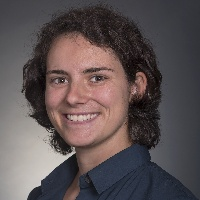
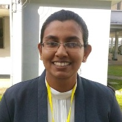

## Steering Committee

<a class="person__item" href="http://www.davidrolnick.com" target="_blank">
  

    
  

  
    David Rolnick (University of Pennsylvania)
  
  

</a>

<a class="person__item" href="https://priyadonti.com/" target="_blank">
  

    
  

  
    Priya L. Donti (Carnegie Mellon University)
  
  

</a>

<a class="person__item" href="https://scholar.google.fr/citations?user=jsy-VxMAAAAJ" target="_blank">
  

    
  

  
    Lynn H. Kaack (ETH Zürich)
  
  

</a>

<a class="person__item" href="http://www.kochanski.org/kelly/" target="_blank">
  

    
  

  
    Kelly Kochanski (University of Colorado at Boulder)
  
  

</a>

<a class="person__item" href="https://scholar.google.com/citations?user=71a2-WMAAAAJ&hl=en" target="_blank">
  

    
  

  
    Alexandre Lacoste (Element AI)
  
  

</a>

<a class="person__item" href="https://mila.quebec/en/person/kris-sankaran/" target="_blank">
  

    
  

  
    Kris Sankaran (Mila, Université de Montréal)
  
  

</a>

<a class="person__item" href="https://scholar.google.com/citations?user=Lf-StbQAAAAJ" target="_blank">
  

    
  

  
    Andrew Slavin Ross (Harvard University)
  
  

</a>

<a class="person__item" href="https://www.mcc-berlin.net/en/about/team/milojevic-dupont-nikola.html" target="_blank">
  

    
  

  
    Nikola Milojevic-Dupont (Mercator Research Institute)
  
  

</a>

<a class="person__item" href="https://www.media.mit.edu/people/jaquesn/overview/" target="_blank">
  

    
  

  
    Natasha Jaques (MIT)
  
  

</a>

<a class="person__item" href="https://www.annawab.com/" target="_blank">
  

    
  

  
    Anna Waldman-Brown (MIT)
  
  

</a>

<a class="person__item" href="https://www.sashaluccioni.com/" target="_blank">
  

    
  

  
    Sasha Luccioni (Mila, Université de Montréal)
  
  

</a>

<a class="person__item" href="http://www.teganmaharaj.com" target="_blank">
  

    
  

  
    Tegan Maharaj (Mila, Université de Montréal)
  
  

</a>

## Advisory Committee

<a class="person__item" href="https://mila.quebec/en/yoshua-bengio/" target="_blank">
  

    
  

  
    Yoshua Bengio (Mila, Université de Montréal)
  
  

</a>

<a class="person__item" href="https://www.microsoft.com/en-us/research/people/jchayes/" target="_blank">
  

    
  

  
    Jennifer Chayes (Microsoft Research)
  
  

</a>

<a class="person__item" href="https://www.mcc-berlin.net/en/about/team/creutzig-felix.html" target="_blank">
  

    
  

  
    Felix Creutzig (Mercator Research Institute)
  
  

</a>

<a class="person__item" href="https://www.cs.cornell.edu/gomes/" target="_blank">
  

    
  

  
    Carla Gomes (Cornell University)
  
  

</a>

<a class="person__item" href="https://en.wikipedia.org/wiki/Demis_Hassabis" target="_blank">
  

    
  

  
    Demis Hassabis (DeepMind)
  
  

</a>

<a class="person__item" href="http://koerding.com/" target="_blank">
  

    
  

  
    Konrad P. Körding (University of Pennsylvania)
  
  

</a>

<a class="person__item" href="https://www.linkedin.com/in/karthikmukkavilli" target="_blank">
  

    
  

  
    S. Karthik Mukkavilli (Mila, Université de Montréal)
  
  

</a>

<a class="person__item" href="https://www.andrewng.org/" target="_blank">
  

    
  

  
    Andrew Y. Ng (Stanford University)
  
  

</a>

<a class="person__item" href="https://ai.google/research/people/JohnPlatt" target="_blank">
  

    
  

  
    John C. Platt (Google AI)
  
  

</a>

## Webmasters

<a class="person__item" href="https://scholar.google.com/citations?user=gYRSXpsAAAAJ" target="_blank">
  

    
  

  
    Narmada Balasooriya (ConscientAI)
  
  

</a>

<a class="person__item" href="https://scholar.google.com/citations?user=Lf-StbQAAAAJ" target="_blank">
  

    
  

  
    Andrew Slavin Ross (Harvard University)
  
  

</a>

<a class="person__item" href="https://www.sashaluccioni.com/" target="_blank">
  

    
  

  
    Sasha Luccioni (Mila, Université de Montréal)
  
  

</a>

<a class="person__item" href="http://www.teganmaharaj.com" target="_blank">
  

    
  

  
    Tegan Maharaj (Mila, Université de Montréal)
  
  

</a>

