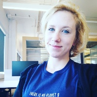

## Steering Committee

<a class="person__item" href="http://www.davidrolnick.com" target="_blank">
  

    
  

  
David Rolnick

  
University of Pennsylvania

  
Chair

</a>

<a class="person__item" href="https://priyadonti.com/" target="_blank">
  

    
  

  
Priya L. Donti

  
Carnegie Mellon

  
Co-Chair

</a>

<a class="person__item" href="https://epg.ethz.ch/people/senior-researchers/dr--lynn-kaack.html" target="_blank">
  

    
  

  
Lynn H. Kaack

  
ETH Zürich

  
Co-Chair

</a>

<a class="person__item" href="https://mila.quebec/en/person/kris-sankaran/" target="_blank">
  

    
  

  
Kris Sankaran

  
Mila, U. de Montréal

  
Partnerships

</a>

<a class="person__item" href="https://www.sashaluccioni.com/" target="_blank">
  

    
  

  
Sasha Luccioni

  
Mila, U. de Montréal

  
Partnerships

</a>

<a class="person__item" href="https://scholar.google.com/citations?user=Lf-StbQAAAAJ" target="_blank">
  

    
  

  
Andrew Slavin Ross

  
Harvard University

  
Website

</a>

<a class="person__item" href="http://www.kochanski.org/kelly/" target="_blank">
  

    
  

  
Kelly Kochanski

  
CU Boulder

  

</a>

<a class="person__item" href="https://scholar.google.com/citations?user=71a2-WMAAAAJ&hl=en" target="_blank">
  

    
  

  
Alexandre Lacoste

  
Element AI

  

</a>

<a class="person__item" href="https://www.mcc-berlin.net/en/about/team/milojevic-dupont-nikola.html" target="_blank">
  

    
  

  
Nikola Milojevic-Dupont

  
MCC Berlin, TU Berlin

  

</a>

<a class="person__item" href="https://www.media.mit.edu/people/jaquesn/overview/" target="_blank">
  

    
  

  
Natasha Jaques

  
MIT

  

</a>

<a class="person__item" href="http://www.teganmaharaj.com" target="_blank">
  

    
  

  
Tegan Maharaj

  
Mila, Polytechnique Montréal

  

</a>

<a class="person__item" href="https://www.evansherwin.com/" target="_blank">
  

    
  

  
Evan D. Sherwin

  
Stanford University

  

</a>

## Advisors

<a class="person__item" href="https://mila.quebec/en/yoshua-bengio/" target="_blank">
  

    
  

  
Yoshua Bengio

  
Mila, U. de Montréal

  

</a>

<a class="person__item" href="https://www.microsoft.com/en-us/research/people/jchayes/" target="_blank">
  

    
  

  
Jennifer Chayes

  
Microsoft Research

  

</a>

<a class="person__item" href="https://www.mcc-berlin.net/en/about/team/creutzig-felix.html" target="_blank">
  

    
  

  
Felix Creutzig

  
MCC Berlin, TU Berlin

  

</a>

<a class="person__item" href="https://ai.google/research/people/JohnPlatt" target="_blank">
  

    
  

  
John C. Platt

  
Google AI

  

</a>

<a class="person__item" href="https://deepmind.com/" target="_blank">
  

    
  

  
Demis Hassabis

  
DeepMind

  

</a>

<a class="person__item" href="https://www.andrewng.org/" target="_blank">
  

    
  

  
Andrew Y. Ng

  
Stanford University

  

</a>

<a class="person__item" href="https://www.cs.cornell.edu/gomes/" target="_blank">
  

    
  

  
Carla Gomes

  
Cornell University

  

</a>

<a class="person__item" href="http://koerding.com/" target="_blank">
  

    
  

  
Konrad P. Körding

  
University of Pennsylvania

  

</a>

<a class="person__item" href="https://www.eye-on.ai" target="_blank">
  

    
  

  
Craig Smith

  
Eye on AI

  

</a>

